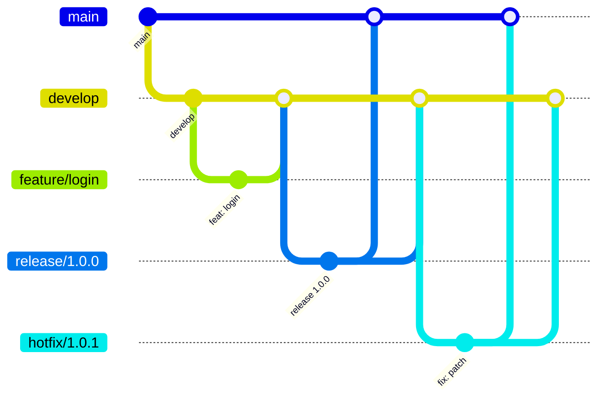

# Guía de contribución

Este proyecto sigue un flujo basado en **GitFlow** con convenciones claras para ramas, commits y Pull Requests.
El objetivo es mantener un historial limpio, ordenado y fácil de entender para todo el equipo.

## 1. Flujo de Ramas

### Ramas base

* **main**: contiene la última versión estable en producción.
* **develop**: contiene los cambios integrados en desarrollo, previo a ser liberados.

### Ramas de trabajo

* **feature/\<descripcion>**

  * Se crean desde `develop`.
  * Usadas para desarrollar nuevas funcionalidades.
  * Se integran nuevamente a `develop` mediante Pull Request.

* **release/x.y.z**

  * Se crean desde `develop` cuando se prepara una versión lista para pruebas o despliegue.
  * Se integran tanto en `main` (para producción) como en `develop` (para sincronización de cambios).

* **hotfix/x.y.z**

  * Se crean desde `main` cuando es necesario resolver un problema crítico en producción.
  * Se integran tanto en `main` como en `develop`.

### Diagrama del flujo de ramas



## 2. Convenciones de commits

Todos los commits deben seguir el estándar de **Conventional Commits**.

Formato básico:

```
<tipo>: <descripción breve>
```

Tipos aceptados:

* **feat**: nueva funcionalidad
* **fix**: corrección de un error
* **docs**: cambios en documentación
* **style**: cambios de formato sin alterar lógica
* **refactor**: cambios en el código sin modificar comportamiento
* **test**: adición o corrección de pruebas
* **chore**: tareas de mantenimiento (build, dependencias, etc.)
* **ci**: cambios en configuración de integración continua
* **build**: cambios que afectan el sistema de compilación o dependencias externas

## 3. Reglas para Pull Requests

* Los PRs deben ser creados desde:

  * `feature/*` → `develop`
  * `release/*` → `main` y `develop`
  * `hotfix/*` → `main` y `develop`

* Cada PR debe:

  * Incluir una descripción clara de los cambios.
  * Requerir al menos una aprobación de otro miembro del equipo (según CODEOWNERS).
  * Pasar todos los checks automáticos configurados (branch rules, convenciones de commits, lint y tests si existen).
  * Usar **solo squash merge** al integrar.

* El **título del PR** debe seguir el formato de **Conventional Commits**, ya que será usado como el mensaje final del commit squash. 

  Ejemplo:

  ```
  feat: agregar navbar
  fix(auth): corregir validación de token
  docs: actualizar guía de contribución
  ```

## 4. Automatización y calidad

* **Checks obligatorios**:

  * Validación del origen de la rama (branch-source).
  * Validación de mensajes de commit y título del PR (commitlint).
  * Ejecución de linter y tests (cuando estén disponibles).

* Solo se podrán mergear PRs que pasen correctamente todos los checks.
